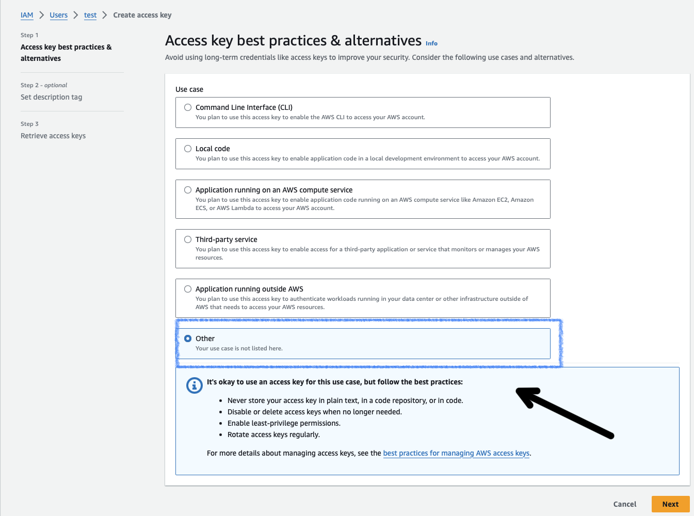
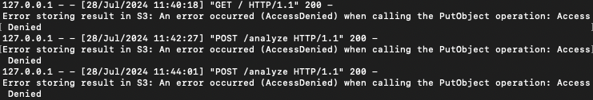

# Cloud-Ready Sentiment Analyzer

This project is a web application that performs sentiment analysis on user-input text using machine learning techniques. It's designed to be cloud-ready and showcases skills in web development, Natural Language Processing (NLP), and cloud technologies.

## Features

- Web-based interface for text input
- Sentiment analysis using TextBlob
- AWS S3 integration (and tutorial) for result storage

## Technologies Used

- Python 3.11.9
- Flask for web application framework
- TextBlob for NLP and sentiment analysis
- Boto3 for AWS S3 interaction

## Setup and Installation

1. Clone the repository:
   ```
   git clone https://github.com/realminhnguyen/cloud-ready-sentiment-analyzer.git
   cd cloud-ready-sentiment-analyzer
   ```

2. Set up a virtual environment (optional but recommended):
   ```
   conda create -n sentiment-analysis-app python=3.11.9
   conda activate sentiment-analysis-app
   ```

3. Install dependencies:
   ```
   pip install -r requirements.txt
   ```

4. Create a `.env` file and use your credentials (keep the single quotes):
    ```
    AWS_ACCESS_KEY_ID='YOUR_KEY'
    AWS_SECRET_ACCESS_KEY='YOUR_SECRET_KEY'
    AWS_REGION='your-region'
    AWS_BUCKET_NAME='your-bucket-name'
    ```
### AWS Setup Help (Extensive)

1. Create AWS Account, set up billing, etc.

2. Create an IAM User:
   - Go to the AWS IAM console
   
   

   - Click "Users" in the left sidebar

   
   
   - Click "Create User" 

   

   - Name the user

   

   - Set permissions and create a policy

   

   - Make a new tab and search for s3 in AWS

   
   - Create a bucket in S3 so we can actually store data

   
   - Name the Bucket

   
   - Back to creating a policy. Create policy using JSON format and use the created bucket name

   
   - Review policy

   
   - Attach policy to created user

   
   - Navigate to created user's keys

   
   - Select key

   
   - Create and copy keys to add into .env file

   
   

## Run the Application

1. Run the application:
   ```
   python app.py
   ```

2. Open a web browser and navigate to `http://localhost:5000`

### Results

- Landing page with user input (pos, neut, neg):


- "Analyze" button pressed. Successful upload:


- NOTE: If you don't have an S3 Bucket created, you will encounter an error:



- We can verify it was uploaded to the S3 bucket:


- Open the file:


And that conludes the project. Thank you for following along!

## Future Enhancements

- Add more advanced NLP techniques
- Implement user authentication and result history
- Implement Docker containerization for easy deployment


## License

This project is open source and available under the [MIT License](LICENSE).